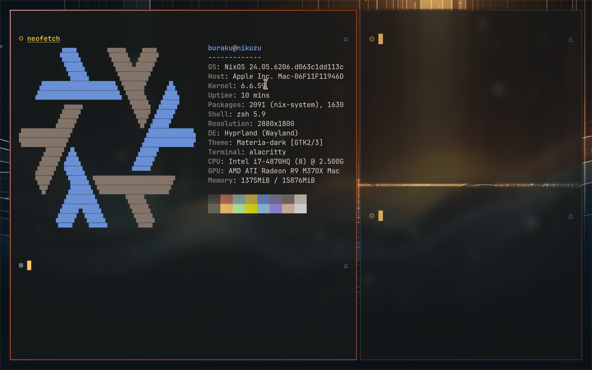
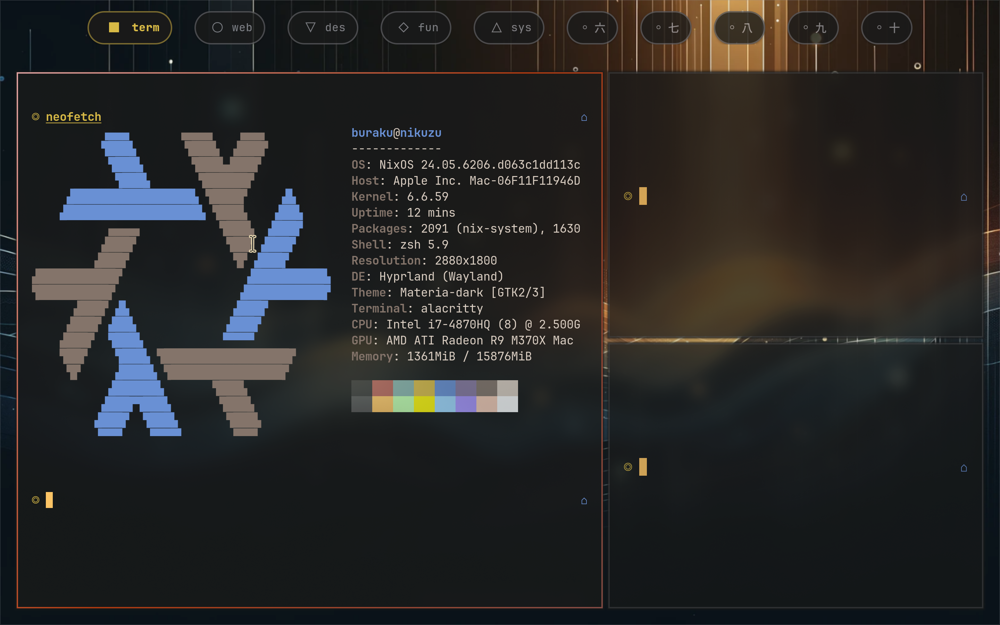
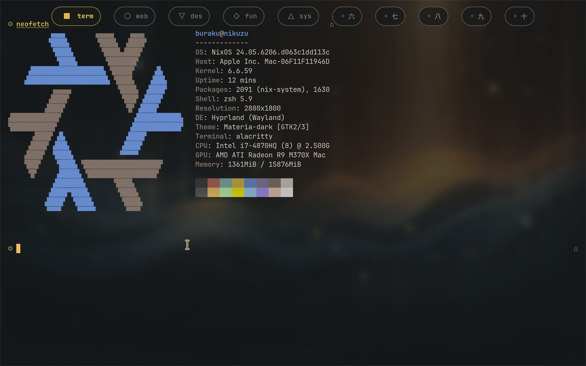
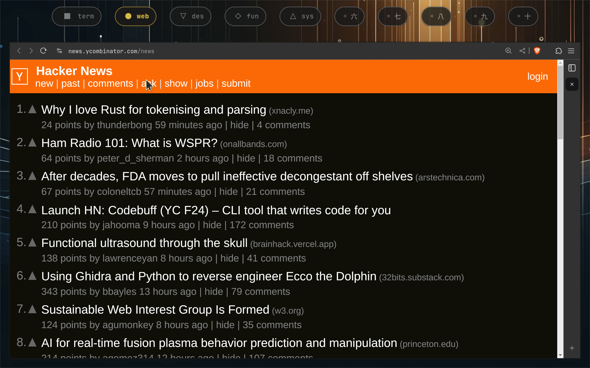

# eww

- [github](https://github.com/elkowar/eww)
- [docs](https://elkowar.github.io/eww/eww.html)

## Widgets

### [Workspace Switcher](./workspace.yuck)

A simple workspace switcher.

https://github.com/user-attachments/assets/a507cac3-2121-4497-89a8-7da49756dc88

#### Screenshots

