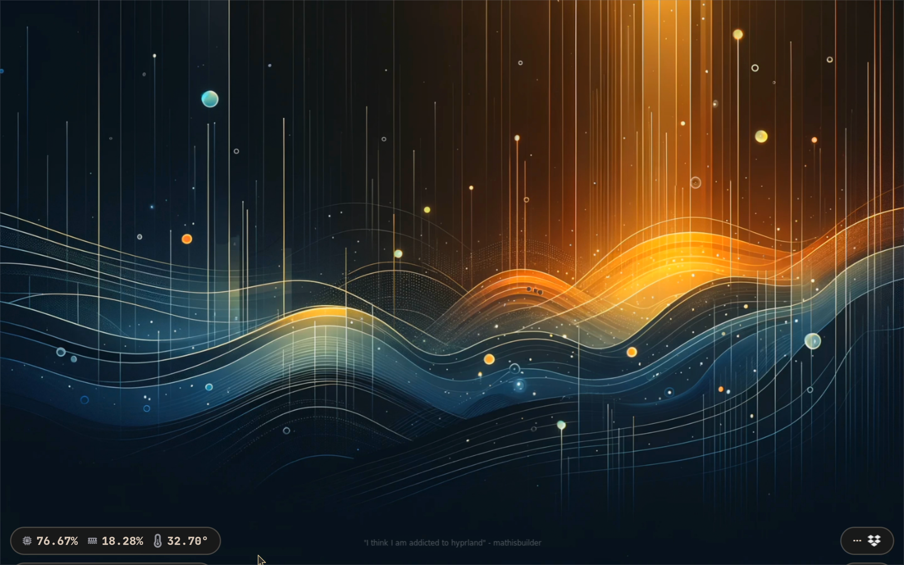
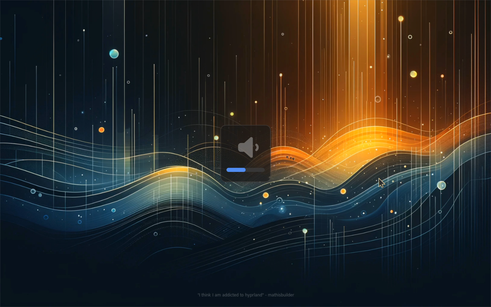
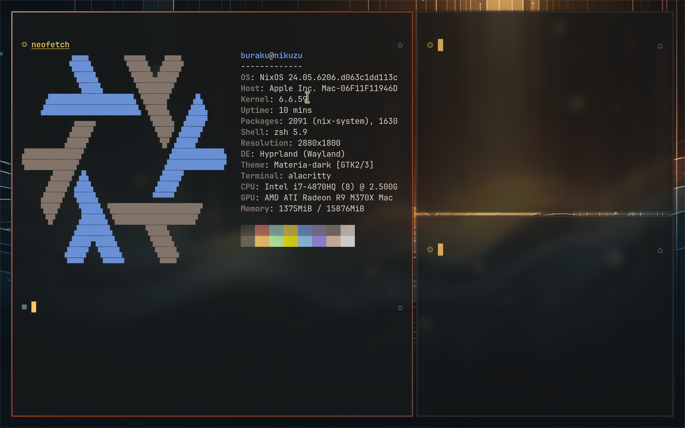
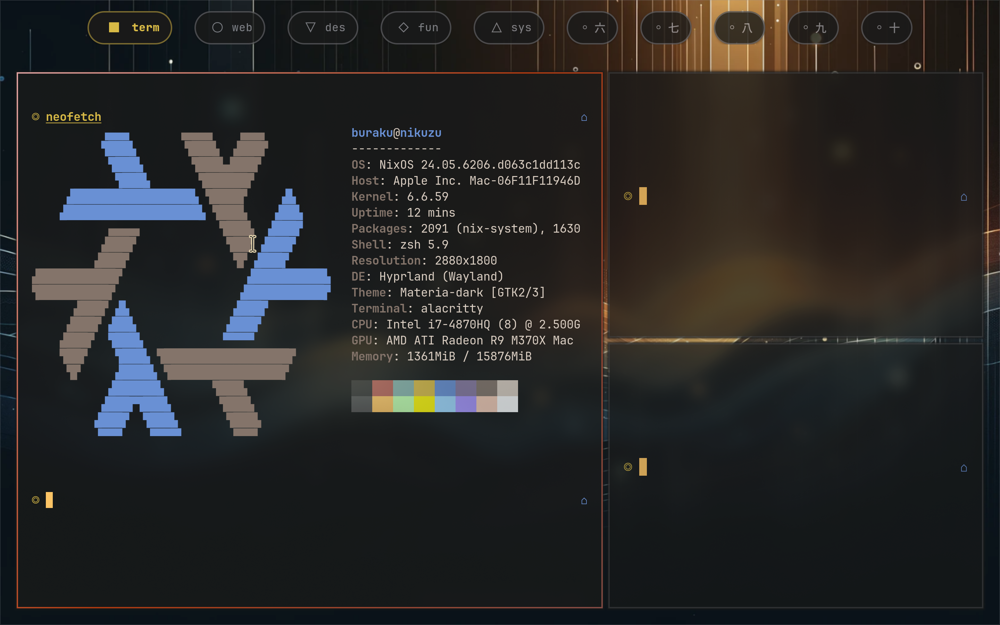
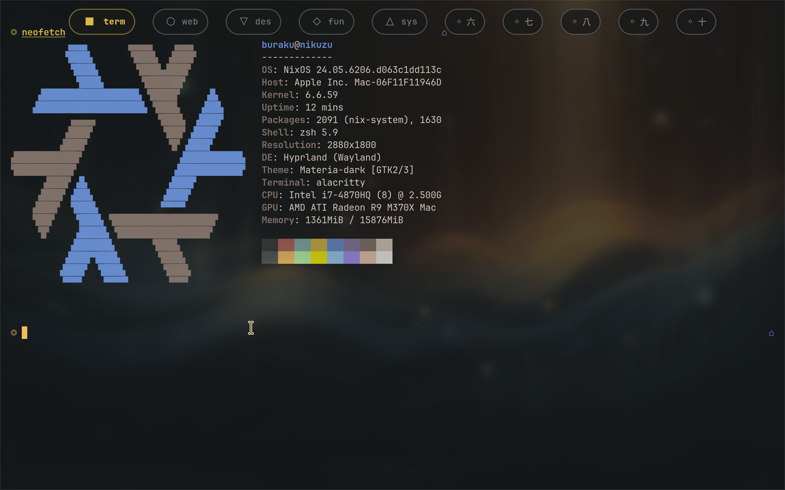
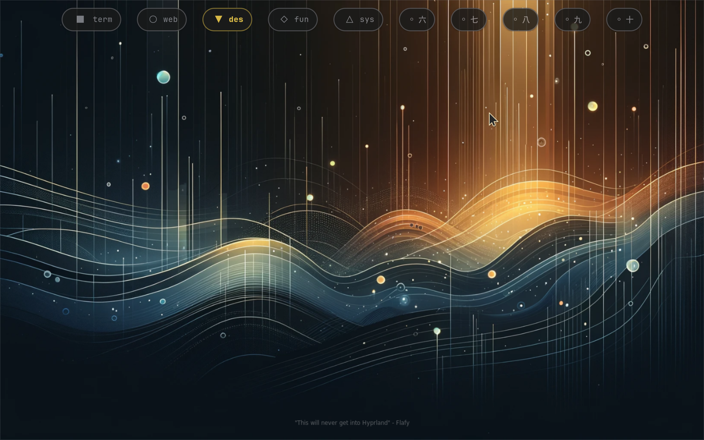
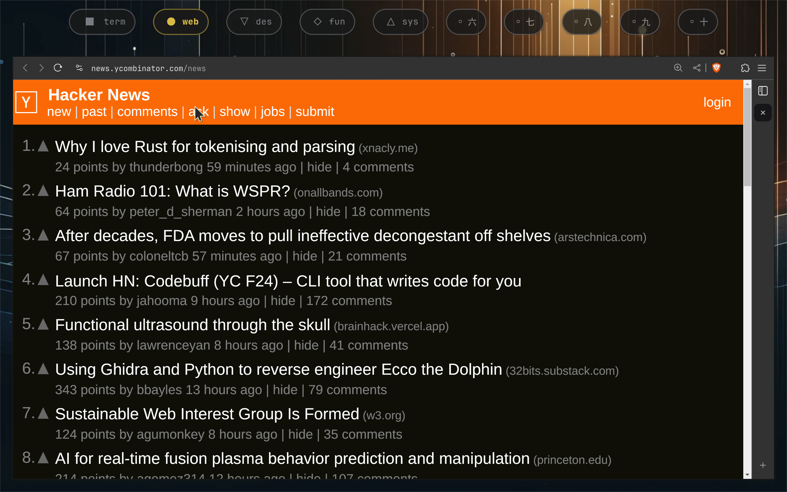
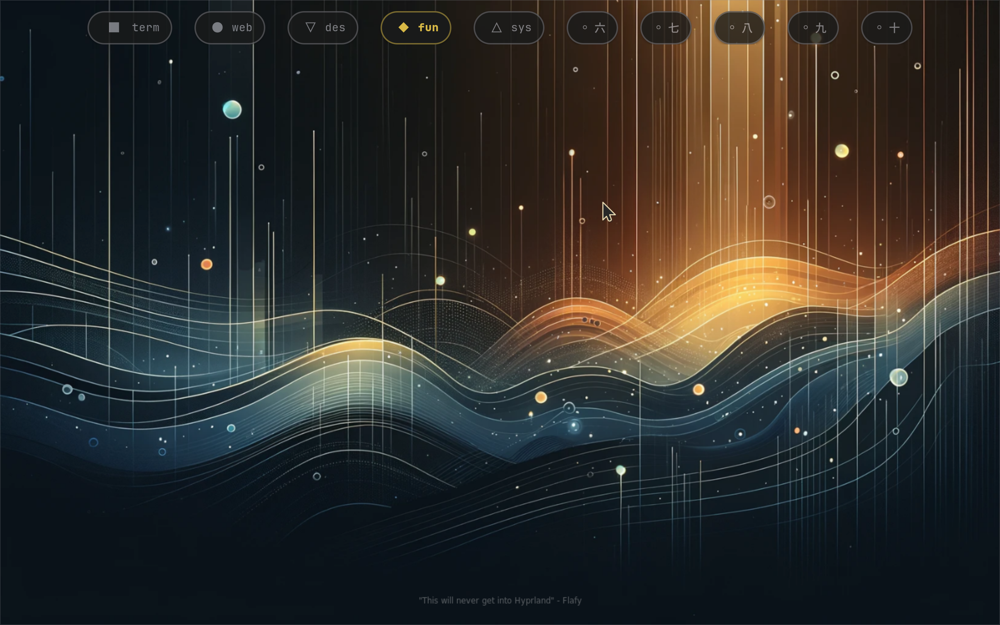

# eww

- [github](https://github.com/elkowar/eww)
- [docs](https://elkowar.github.io/eww/eww.html)

## Widgets

### Bars & Indicators

https://github.com/user-attachments/assets/2d63c96a-e8cf-463f-bbb1-95165076d89b

The [**menubar**](./menubar.yuck) sits at the _top_ edge of the screen and revealed on hover.

- Left
  - [Date](./date.yuck)
- Right
  - [Volume (Indicator)](./volume.yuck) - controls (slider) and mute button
  - [Network](./network.yuck) - general status
  - [Battery](./battery.yuck) - time left and percentage

---

The **indicators** are revealed when the media keys are pressed to adjust [**volume**](./volume.yuck) or screen brightness ([**light**](./light.yuck)).

---

The [**traybar**](./traybar.yuck) sits at the _bottom_ edge of the screen and revealed on hover.

- Left
  - CPU
  - Memory
  - Temperature (Celsius)
- Right
  - System Tray

#### Screenshots

##### Menubar

##### Traybar

##### Indicators

### [Workspace Switcher](./workspace.yuck)

A simple workspace switcher.

https://github.com/user-attachments/assets/a507cac3-2121-4497-89a8-7da49756dc88

#### Screenshots

